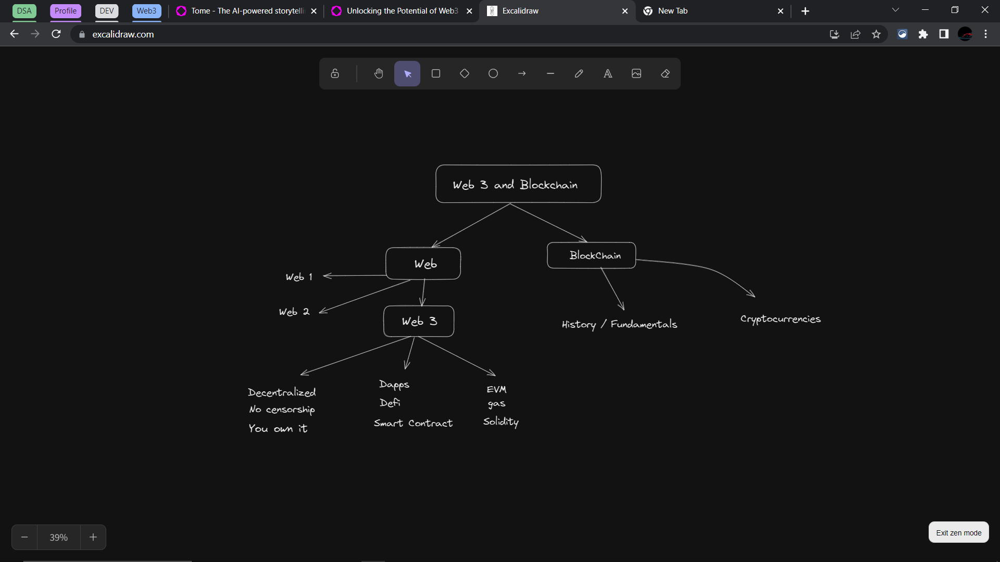
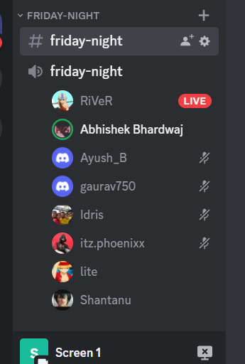

# week 9

2023 / March / week-9

### Extension

1. Very helpful for competitive programming on Codechef
   * [https://marketplace.visualstudio.com/items?itemName=DivyanshuAgrawal.competitive-programming-helper](https://marketplace.visualstudio.com/items?itemName=DivyanshuAgrawal.competitive-programming-helper)
2. black box extension for vscode
   * [https://marketplace.visualstudio.com/items?itemName=Blackboxapp.blackbox](https://marketplace.visualstudio.com/items?itemName=Blackboxapp.blackbox)

## Friday-Night


```
only talked related to
`Web3` in Discussion

Mostly by @lite / Vedant Chaudhari
which he is learning in #100DaysOfCodeChallenge

and helped by @Abhishek Bhardwaj
```


### Discuss On

<figure><figcaption><p>all talk was surrouned around it</p></figcaption></figure>

#### Other

* 1 Sec App :- [https://one-sec.app/](https://one-sec.app/)
* Ai to create ppt [https://beta.tome.app/](https://beta.tome.app/)
  * example for web3
  * [https://tome.app/lite-55a/unlocking-the-potential-of-web3-and-blockchain-clesncuvc00cdc9ksgwh5ugqh](https://tome.app/lite-55a/unlocking-the-potential-of-web3-and-blockchain-clesncuvc00cdc9ksgwh5ugqh)
* threejs projects ... [https://threejs.org/](https://threejs.org/)

#### Web 3 Related

* centralized vs decentralized data
* web 1 vs 2 vs 3
* usecase of it
* Like spotify :- [https://audius.co/](https://audius.co/)
* [https://ipfs.tech/](https://ipfs.tech/)
* ICP :- [https://internetcomputer.org/](https://internetcomputer.org/)
  * list of projects on web3
  * [https://internetcomputer.org/ecosystem](https://internetcomputer.org/ecosystem)
* evm web3 :- [https://ethereum.org/](https://ethereum.org/)
* [https://etherscan.io/](https://etherscan.io/)
* YouTuber recommended
  * English :- [https://www.youtube.com/@CoinBureau](https://www.youtube.com/@CoinBureau)
  * Hindi :- [https://www.youtube.com/@CodeEater21/](https://www.youtube.com/@CodeEater21/videos)
* #### Many topics like ... related to web3
  * blockchain
    * sha256 algorithm in blockchain
  * crypto
  * bitcoin
    * bitcoin block time
  * metaverse
  * NFT
  * ..... etc

### Participant

<figure><figcaption></figcaption></figure>
